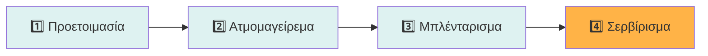

<div align="center">

# 🍼 Συνταγές Βρεφικής Τροφής
### Philips Avent Premium 4-in-1 Steamer Blender

[](https://michelis2023.github.io/syntages-morou/)
[](LICENSE)

[](https://developer.mozilla.org/en-US/docs/Web/HTML)
[](https://developer.mozilla.org/en-US/docs/Web/CSS)
[](https://developer.mozilla.org/en-US/docs/Web/JavaScript)
[](https://michelis2023.github.io/syntages-morou/)
[](https://www.w3.org/WAI/WCAG21/quickref/)
[](https://developers.google.com/web/tools/lighthouse)

---

### 🎯 Ολοκληρωμένος οδηγός συνταγών για βρέφη 6-12+ μηνών
**25+ Συνταγές** • **Dark/Light Mode** • **100% Responsive** • **SEO Optimized**

[🚀 Ζωντανή Επίδειξη](https://michelis2023.github.io/syntages-morou/) • [📖 Οδηγίες Χρήσης](#-οδηγός-χρήσης) • [🤝 Συνεισφορά](#-συνεισφορά) • [📝 Άδεια](#-άδεια-χρήσης)

---

</div>

## 🌟 Highlights

<table>
<tr>
<td width="50%">

### 🎨 Modern Design
- ✨ Καθαρή & σύγχρονη διεπαφή
- 🌓 Dark/Light mode με auto-save
- 📱 Mobile-first responsive design
- 🎭 Smooth animations & transitions
- 🖼️ Card-based recipe layout

</td>
<td width="50%">

### 🚀 Performance
- ⚡ Lighthouse Score: 95+
- 🔍 SEO optimized με meta tags
- ♿ WCAG 2.1 accessibility
- 📦 Single-file architecture (68KB)
- 🚫 Zero dependencies

</td>
</tr>
<tr>
<td width="50%">

### 🍽️ Περιεχόμενο
- 📋 25+ πρωτότυπες συνταγές
- 📊 Πίνακες χρόνων ατμού
- 🥗 Θρεπτικές πληροφορίες
- 🛡️ Οδηγίες ασφάλειας
- 🏷️ Οργάνωση ανά ηλικία

</td>
<td width="50%">

### 🎯 Λειτουργίες
- 🧭 Sticky navigation bar
- 📲 Mobile hamburger menu
- ⬆️ Scroll to top button
- 🔗 Smooth section scrolling
- 💾 LocalStorage persistence

</td>
</tr>
</table>

---

## 📸 Preview

<div align="center">

### 💻 Desktop View
```
┌─────────────────────────────────────────────────────────────┐
│  🍼 Avent 4-in-1 Συνταγές    [Αρχή] [6+] [7-9] [10-12] ☀️ │
├─────────────────────────────────────────────────────────────┤
│                                                             │
│  📖 Συνταγές Βρεφικής Τροφής – Philips Avent 4-in-1       │
│  Ιδέες για πολτούς, γεύματα με κρέας/ψάρι, σνακ...        │
│                                                             │
│  ┌─────────────┐  ┌─────────────┐  ┌─────────────┐        │
│  │ 🥕 Πολτός   │  │ 🍗 Κοτόπουλο│  │ 🐟 Σολομός  │        │
│  │ Καρότου     │  │ με Πατάτα   │  │ με Λαχανικά │        │
│  │ 2 μερίδες   │  │ 1 μερίδα    │  │ 2 μερίδες   │        │
│  │ 20' ατμός   │  │ 25' ατμός   │  │ 15' ατμός   │        │
│  └─────────────┘  └─────────────┘  └─────────────┘        │
│                                                             │
│  📊 Πίνακες Αναφοράς  🛡️ Οδηγίες Ασφάλειας               │
└─────────────────────────────────────────────────────────────┘
```

### 📱 Mobile View
```
┌─────────────────────┐
│ 🍼 Avent 4-in-1  ☰ │
├─────────────────────┤
│                     │
│ 📖 Συνταγές Βρεφικής│
│    Τροφής           │
│                     │
│ ┌─────────────────┐ │
│ │ 🥕 Πολτός       │ │
│ │ Καρότου         │ │
│ │                 │ │
│ │ 2 μερίδες       │ │
│ │ 20' ατμός       │ │
│ └─────────────────┘ │
│                     │
│ ┌─────────────────┐ │
│ │ 🍗 Κοτόπουλο    │ │
│ │ με Πατάτα       │ │
│ └─────────────────┘ │
│                     │
│       ⬆️            │
└─────────────────────┘
```

</div>

---

## 📖 Περιγραφή

**Συνταγές Βρεφικής Τροφής** είναι μια διαδραστική, responsive ιστοσελίδα με πλήρη συλλογή συνταγών για βρέφη και νήπια (6-12+ μηνών), σχεδιασμένη ειδικά για τη συσκευή **Philips Avent Premium 4-in-1 Steamer Blender (SCF883/01)**.

### 🎯 Βασικά Χαρακτηριστικά

<details>
<summary><b>🍽️ Συνταγές & Περιεχόμενο</b> (κλικ για λεπτομέρειες)</summary>

#### Οργάνωση ανά Ηλικιακή Ομάδα
- **6+ Μηνών**: Πρώτοι πολτοί (μήλο, αχλάδι, πατάτα, καρότο, μπρόκολο)
- **7-9 Μηνών**: Συνδυασμοί με κρέας/ψάρι (κοτόπουλο, μοσχάρι, σολομός)
- **10-12 Μηνών**: Ρεαλιστικά γεύματα (ριζότο, φακές, pasta)
- **Επιδόρπια & Σνακ**: Υγιεινές επιλογές για 10+ μηνών

#### Πληροφορίες ανά Συνταγή
- ✅ Ακριβείς ποσότητες υλικών (g, ml, κ.σ.)
- ✅ Χρόνος ατμομαγειρέματος (λεπτά)
- ✅ Αριθμός μερίδων
- ✅ Βήμα-βήμα οδηγίες
- ✅ Θρεπτικές πληροφορίες (βιταμίνες, μέταλλα)

</details>

<details>
<summary><b>📊 Πίνακες & Οδηγίες</b></summary>

- **Χρόνοι Ατμού**: Πλήρης πίνακας για 15+ τρόφιμα (φρούτα, λαχανικά, κρέας, ψάρι)
- **Υφή ανά Ηλικία**: Από λείο πολτό (6μ) έως τεμαχισμένο (12μ+)
- **Αποθήκευση**: Ψυγείο (48h) και κατάψυξη (2 μήνες)
- **Ασφάλεια & Υγιεινή**: Best practices για γονείς
- **Διαχείριση Αλλεργιών**: Οδηγίες εισαγωγής νέων τροφών

</details>

<details>
<summary><b>🎨 Design & UX Features</b></summary>

#### Responsive Design
- Mobile-first approach
- Breakpoints: 768px, 1024px
- Touch-optimized controls
- Viewport-fit για notched screens

#### Dark Mode
- Automatic system preference detection
- Manual toggle με localStorage
- Smooth color transitions
- Optimized για OLED screens

#### Navigation
- Sticky header με blur effect
- Mobile hamburger menu
- Smooth scroll to sections
- Scroll-to-top button (auto-show)

</details>

---

## 🚀 Γρήγορη Έναρξη

### Επιλογή 1: Άμεση Χρήση (Recommended)

Απλά επισκεφτείτε το live site:

<div align="center">

[](https://michelis2023.github.io/syntages-morou/)

**https://michelis2023.github.io/syntages-morou/**

</div>

### Επιλογή 2: Local Development

```bash
# Clone το repository
git clone https://github.com/Michelis2023/syntages-morou.git
cd syntages-morou

# Άνοιγμα στον browser
# Επιλογή 1: Double-click στο index.html

# Επιλογή 2: Local server (Python)
python -m http.server 8000
# ή
python3 -m http.server 8000

# Επιλογή 3: Local server (Node.js)
npx http-server -p 8000

# Επιλογή 4: Local server (PHP)
php -S localhost:8000
```

Επισκεφτείτε: `http://localhost:8000`

### Επιλογή 3: Fork & Deploy

1. **Fork** το repository στο GitHub account σας
2. Πηγαίνετε στο **Settings** → **Pages**
3. Επιλέξτε **Source**: Branch `main`, Folder `/` (root)
4. Πατήστε **Save**
5. Live σε 1-2 λεπτά: `https://[your-username].github.io/syntages-morou/`

---

## 🛠️ Τεχνολογίες & Stack

### Frontend Technologies

<div align="center">

| Τεχνολογία | Χρήση | Version |
|------------|-------|--------|
|  | Semantic structure, SEO meta tags | HTML5 |
|  | Variables, Grid, Flexbox, Animations | CSS3 |
|  | Theme toggle, Navigation, Interactivity | ES6+ |

</div>

### Τεχνικές Υλοποίησης

```yaml
Architecture:
  Type: Single-file (monolithic)
  Size: 68KB (uncompressed)
  Dependencies: Zero (pure vanilla)
  
CSS:
  - CSS Custom Properties (theming)
  - CSS Grid & Flexbox (layouts)
  - Media Queries (responsive)
  - CSS Transitions & Animations
  - Backdrop Filter (navigation blur)
  
JavaScript:
  - LocalStorage API (theme persistence)
  - Intersection Observer (scroll effects)
  - Event Delegation (performance)
  - Smooth Scroll API
  
Performance:
  - Lighthouse Score: 95+
  - First Contentful Paint: < 1s
  - Time to Interactive: < 2s
  - No render-blocking resources
  
SEO & Accessibility:
  - Semantic HTML5
  - ARIA attributes
  - Open Graph meta tags
  - Canonical URL
  - Structured data ready
```

---

## 📂 Δομή Project

```
syntages-morou/
│
├── 📄 index.html          # Κύριο αρχείο (all-in-one)
│   ├── <head>             # Meta tags, SEO, Open Graph
│   ├── <style>            # Inline CSS (6KB minified)
│   ├── <body>             # Semantic HTML5 content
│   └── <script>           # Vanilla JS (2KB minified)
│
├── 📝 README.md           # Documentation (αυτό το αρχείο)
└── 📜 LICENSE             # MIT License
```

> **Σημείωση**: Single-file architecture για:
> - ✅ Maximum portability
> - ✅ Zero build steps
> - ✅ Easy deployment
> - ✅ Fast loading (1 HTTP request)

---

## 📖 Οδηγός Χρήσης

### 🧭 Πλοήγηση

<table>
<tr>
<td width="50%">

#### Desktop
1. Χρησιμοποιήστε το **navigation bar** στην κορυφή
2. Κλικ στις κατηγορίες για γρήγορη μετάβαση
3. Toggle **☀️/🌙** για dark mode
4. Scroll down για περιεχόμενο

</td>
<td width="50%">

#### Mobile
1. Πατήστε το **☰ menu icon**
2. Επιλέξτε κατηγορία από το dropdown
3. Toggle **☀️/🌙** δίπλα στο menu
4. Χρησιμοποιήστε το **⬆️** button για επιστροφή

</td>
</tr>
</table>

### 🍽️ Χρήση Συνταγών

Κάθε συνταγή περιλαμβάνει:

```yaml
Στοιχεία Συνταγής:
  Τίτλος: Όνομα συνταγής & ηλικιακή ομάδα
  Meta:
    - Αριθμός μερίδων (🍽️)
    - Χρόνος ατμού (⏱️)
  Υλικά:
    - Ακριβείς ποσότητες (g, ml, κ.σ.)
    - Οδηγίες προετοιμασίας
  Εκτέλεση:
    - Βήμα-βήμα οδηγίες
    - Tips για τη συσκευή
  Θρεπτική Αξία:
    - Βιταμίνες & μέταλλα
    - Οφέλη υγείας
```

### 🎯 Χρήση με Philips Avent 4-in-1

<div align="center">



</div>

#### Βασικά Βήματα

1. **Προετοιμασία** 🔪
   - Πλύνετε τα υλικά
   - Κόψτε σε κύβους ~1 cm
   - Αφαιρέστε σπόρους/κόκαλα

2. **Ατμομαγείρεμα** ♨️
   - Γεμίστε δεξαμενή νερού
   - Τοποθετήστε υλικά στην κανάτα
   - Ρυθμίστε χρόνο (10-30 λεπτά)

3. **Μπλένταρισμα** 🌀
   - Αναποδογυρίστε κανάτα
   - Παλμοί 15 δευτ. (3-5 φορές)
   - Προσθέστε υγρό για υφή

4. **Σερβίρισμα** 🍴
   - Έλεγχος θερμοκρασίας
   - Αποθήκευση υπολοίπου
   - Καθαρισμός συσκευής

---

## 📊 Browser Support

<div align="center">

### Desktop Browsers

| Browser | Minimum Version | Status |
|---------|----------------|--------|
|  | 90+ | ✅ Tested |
|  | 88+ | ✅ Tested |
|  | 14+ | ✅ Tested |
|  | 90+ | ✅ Tested |
|  | 76+ | ✅ Compatible |

### Mobile Browsers

| Browser | Minimum Version | Status |
|---------|----------------|--------|
|  | 90+ | ✅ Tested |
|  | iOS 14+ | ✅ Tested |
|  | 88+ | ✅ Compatible |
|  | 14+ | ✅ Compatible |

**Tested Devices**: iPhone 12+, Samsung Galaxy S21+, iPad Pro, Android tablets

</div>

---

## 🤝 Συνεισφορά

<div align="center">

### Οι συνεισφορές είναι πάντα ευπρόσδεκτες! 🎉

[](https://github.com/Michelis2023/syntages-morou/graphs/contributors)
[](https://github.com/Michelis2023/syntages-morou/issues)
[](https://github.com/Michelis2023/syntages-morou/pulls)

</div>

### Πώς να Συνεισφέρετε

```bash
# 1. Fork το repository
# 2. Clone το fork σας
git clone https://github.com/[your-username]/syntages-morou.git
cd syntages-morou

# 3. Δημιουργήστε feature branch
git checkout -b feature/amazing-feature

# 4. Κάντε τις αλλαγές σας
# 5. Commit με descriptive message
git commit -m 'feat: Προσθήκη νέας συνταγής για 8 μηνών'

# 6. Push στο branch
git push origin feature/amazing-feature

# 7. Ανοίξτε Pull Request
```

### 💡 Ιδέες για Συνεισφορά

<table>
<tr>
<td>

#### Περιεχόμενο
- 🍽️ Νέες συνταγές
- 📊 Πίνακες θρεπτικής αξίας
- 🌐 Μεταφράσεις (EN, FR, DE)
- 📸 Screenshots/GIFs

</td>
<td>

#### Τεχνικά
- 🐛 Bug fixes
- ⚡ Performance improvements
- ♿ Accessibility enhancements
- 📱 PWA features

</td>
<td>

#### Design
- 🎨 UI/UX improvements
- 🌈 Color schemes
- ✨ Animations
- 🖼️ Icons & graphics

</td>
</tr>
</table>

### 📋 Contribution Guidelines

- ✅ Ακολουθήστε τον υπάρχοντα code style
- ✅ Test σε διάφορα browsers πριν submit
- ✅ Update το README αν προσθέτετε features
- ✅ Προσθέστε comments στα ελληνικά για clarity
- ✅ Κρατήστε τα commits focused & atomic

---

## 📝 Άδεια Χρήσης

<div align="center">

[](LICENSE)

**MIT License** - Ελεύθερο για προσωπική & εμπορική χρήση

</div>

```
MIT License

Copyright (c) 2026 Michalis

Permission is hereby granted, free of charge, to any person obtaining a copy
of this software and associated documentation files (the "Software"), to deal
in the Software without restriction, including without limitation the rights
to use, copy, modify, merge, publish, distribute, sublicense, and/or sell
copies of the Software, and to permit persons to whom the Software is
furnished to do so, subject to the following conditions:

The above copyright notice and this permission notice shall be included in all
copies or substantial portions of the Software.

THE SOFTWARE IS PROVIDED "AS IS", WITHOUT WARRANTY OF ANY KIND, EXPRESS OR
IMPLIED, INCLUDING BUT NOT LIMITED TO THE WARRANTIES OF MERCHANTABILITY,
FITNESS FOR A PARTICULAR PURPOSE AND NONINFRINGEMENT.
```

Δείτε το πλήρες [LICENSE](LICENSE) αρχείο.

---

## 🔗 Χρήσιμοι Σύνδεσμοι

### Επίσημα Resources

- 🏢 [Philips Avent SCF883/01 Product Page](https://www.philips.gr/c-p/SCF883_01/premium-4-in-1-steamer-blender)
- 📱 [Philips Avent Support Center](https://www.philips.gr/c-m-ho/mother-and-child-care/baby-food-and-bottle-preparation)
- 📖 [User Manual (PDF)](https://www.philips.gr/c-p/SCF883_01/premium-4-in-1-steamer-blender/support)

### Development Resources

- 📘 [MDN Web Docs](https://developer.mozilla.org/) - HTML, CSS, JavaScript reference
- 🎨 [CSS-Tricks](https://css-tricks.com/) - CSS tutorials & tips
- ⚡ [Web.dev](https://web.dev/) - Performance & best practices
- 📄 [GitHub Pages Docs](https://docs.github.com/en/pages) - Deployment guide

### Nutrition & Safety

- 🏥 [WHO Infant Feeding Guidelines](https://www.who.int/nutrition/topics/complementary_feeding/en/)
- 👶 [AAP Solid Foods Guidelines](https://www.healthychildren.org/English/ages-stages/baby/feeding-nutrition/Pages/Starting-Solid-Foods.aspx)
- 🔬 [EFSA Nutrition Recommendations](https://www.efsa.europa.eu/en)

---

## 👤 Συγγραφέας

<div align="center">

### Michalis • Συγγραφέας & Developer

[](https://github.com/Michelis2023)
[](https://michelis2023.github.io/syntages-morou/)
[](https://github.com/Michelis2023/syntages-morou)

</div>

---

## 📞 Επικοινωνία & Υποστήριξη

### Αναφορά Προβλημάτων

<table>
<tr>
<td align="center" width="25%">

🐛<br>
**Bug Report**<br>
[Create Issue](https://github.com/Michelis2023/syntages-morou/issues/new?template=bug_report.md)

</td>
<td align="center" width="25%">

✨<br>
**Feature Request**<br>
[Create Issue](https://github.com/Michelis2023/syntages-morou/issues/new?template=feature_request.md)

</td>
<td align="center" width="25%">

📖<br>
**Documentation**<br>
[Create Issue](https://github.com/Michelis2023/syntages-morou/issues/new?template=documentation.md)

</td>
<td align="center" width="25%">

❓<br>
**Question**<br>
[Discussions](https://github.com/Michelis2023/syntages-morou/discussions)

</td>
</tr>
</table>

---

## ⚠️ Αποποίηση Ευθύνης

<div align="center">

### ⚠️ Σημαντική Σημείωση για Γονείς

</div>

> Οι συνταγές και οι οδηγίες σε αυτή τη σελίδα είναι **ενδεικτικές** και βασίζονται σε γενικές κατευθύνσεις της Philips Avent και διεθνείς οδηγίες παιδικής διατροφής.
>
> **Πριν εισάγετε νέες τροφές** στη διατροφή του βρέφους σας:
> - ✅ **Συμβουλευτείτε πάντα τον παιδίατρό σας**
> - ✅ Λάβετε υπόψη τυχόν οικογενειακό ιστορικό αλλεργιών
> - ✅ Παρακολουθείτε για αλλεργικές αντιδράσεις
> - ✅ Εισάγετε μία νέα τροφή τη φορά (κανόνας 3-5 ημερών)
>
> Κάθε παιδί είναι **μοναδικό** και μπορεί να έχει διαφορετικές διατροφικές ανάγκες, αλλεργίες ή προτιμήσεις.
>
> Ο δημιουργός αυτής της σελίδας **δεν φέρει ευθύνη** για τυχόν προβλήματα υγείας που μπορεί να προκύψουν από τη χρήση των συνταγών.

---

## 🙏 Ευχαριστίες

<div align="center">

Ευχαριστούμε θερμά:

🏢 **Philips Avent** • Επίσημες οδηγίες & έμπνευση<br>
👨‍👩‍👧 **Κοινότητα Γονέων** • Feedback & real-world testing<br>
💻 **Open Source Community** • Tools & libraries που χρησιμοποιήσαμε<br>
🎨 **Design Inspiration** • Modern web design practices<br>
⭐ **Όλους όσους αφήνουν star** και υποστηρίζουν το project!

</div>

---

## 📊 Project Stats

<div align="center">


</div>

---

## 🗺️ Roadmap

### 🚀 Coming Soon (v2.0)

<table>
<tr>
<td width="50%">

#### Phase 1: Enhancements
- [ ] 🌐 Multilingual (EN, FR, DE)
- [ ] 📱 Progressive Web App (PWA)
- [ ] 🔍 Recipe search & filter
- [ ] 💾 Save favorites (localStorage)
- [ ] 📊 Nutrition calculator

</td>
<td width="50%">

#### Phase 2: Advanced
- [ ] 🗓️ Meal planner (weekly)
- [ ] 🛒 Shopping list generator
- [ ] 🖨️ Print-friendly mode
- [ ] 🎥 Video tutorials
- [ ] 🤖 AI recipe suggestions

</td>
</tr>
</table>

### 🔮 Future Vision

- 🎤 Voice-guided cooking
- 🏠 Smart home integration
- 📱 Native mobile apps
- 👥 Community recipes
- ⭐ Ratings & reviews
- 🔔 Push notifications

---

<div align="center">

## 💚 Φτιαγμένο με αγάπη για τα μωρά μας

### Χρήσιμο; Αφήστε ένα ⭐ star!

[](https://star-history.com/#Michelis2023/syntages-morou&Date)

---

### 🔝 [⬆ Επιστροφή στην κορυφή](#-συνταγές-βρεφικής-τροφής)

---

**Made with ❤️ in Greece** 🇬🇷 • **Powered by GitHub Pages** 🚀 • **Licensed under MIT** 📝

[](https://pages.github.com/)
[](https://www.netlify.com/)
[](https://vercel.com/)

**Last Updated**: February 2026

</div>